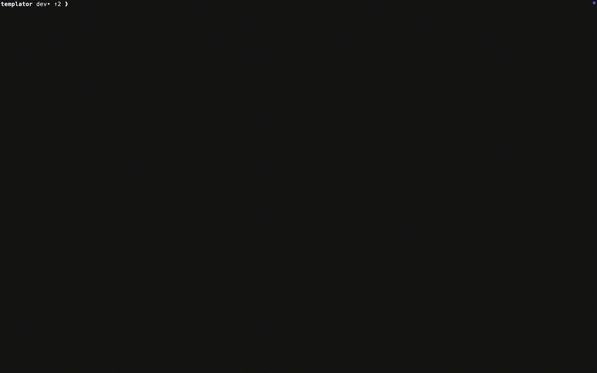

# lacune

## Install

```sh
go install github.com/alesr/lacune@latest

## Features

```
- visualize inline code coverage
- re-run tests on demand
- scroll through and search code
```



## Usage

Run `lacune` in the root directory of your Go project (where your `go.mod` file is located). It will automatically detect your test files and coverage profiles.

## Contribute

Contributions are welcome! Open an issue or submit a PR.
